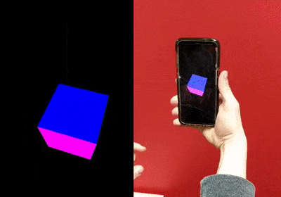

# NAVS

NAVS (NDK-Android-Vulkan-Senors) is a set of examples showing how to mix NDK Sensors with Vulkan Graphics

# Current setup test
- Android Studio 3.1.1
- Android API 26 (8.0 Oreo)
- Build Tools 27.0.3

# How To Run

All apps self contain all libraries and other code needed to run, simply open any of the folders in Android Studio, build and run. Leave an [issue](https://github.com/sjfricke/NDK-Android-Vulkan-Senors/issues) if something doesn't build or work correctly

# Current Examples

## [Accelerometer-Cube](./Accelerometer-Cube)

This demo shows how to mix Vulkan with the NDK accelerometer sensor to make for some very primative AR/VR style movement with high performance graphics

## [Heart-Beat-Threading]

This demo shows how to utalize your multicore Android CPU to build command buffers while using the heartbeat sensor on the device

- CURRENT WORK IN PROGRESS